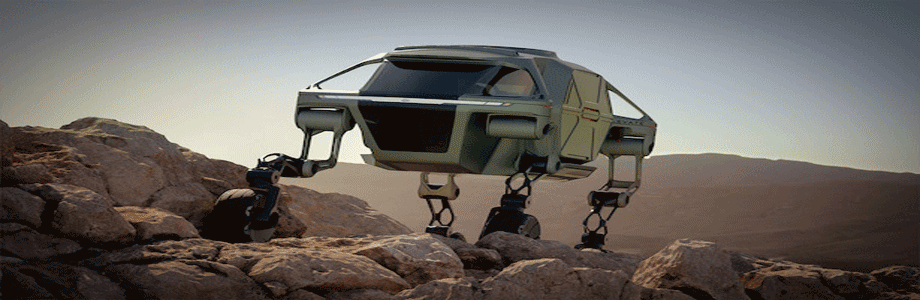
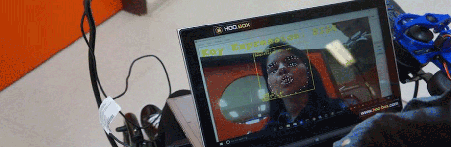

# 

# movilidad-emergencia

[Elévate (+ info)](https://www.hyundainews.com/en-us/releases/2680) - Elevate, el Vehículo de movilidad máxima.
# 
>* Hyundai dio a conocer su concepto para un automóvil andante llamado Elévate, el vehículo tendría patas robóticas extensibles, lo que le permitiría negociar terrenos peligrosos e irregulares.  
El fabricante de automóviles de Corea del Sur afirma que el vehículo podría ayudar a los trabajadores de emergencia a rescatar a las personas en áreas de difícil acceso, además de ser adecuado para su uso en las ciudades. Con sus largas patas robóticas, el Elévate está diseñado para conducir, caminar o escalar el terreno más traicionero, al que los vehículos normales no pueden acceder.
Lo más emocionante de este proyecto es que no solo tienen capacidad para ayudar en emergencias si no que también para adaptarse parea personas discapacitadas, aproximándose a ellos sin necesitar de sus esfuerzos o rampas), como también podrá modificarse levemente para usase en exploraciones en el espacio, en visitas a diversos planetas que muchas veces cuentan con suelos duros o irregulares.

<!---
Referente Carolina Bustamante
-->

[Perro robotico (video)](https://www.youtube.com/watch?v=ssrk9bW2xBk) - Este perro de entrega robot
# 
>* Este perro robótico, que te entrega tus paquetes directamente a su puerta, fue hecho por la compañía automotriz alemana Continental. No puedo evitar pensar en sustituir en zonas rurales animales de carga con este perro robótico ya que podría llevar elementos pesados y podría ajustarse para zonas rocosas o complejas.

<!---
Referente Carolina Bustamante
-->

[Silla de rueda inteligente (video)](https://www.youtube.com/watch?v=6LfE3mQzLNY&feature=emb_logo) - Silla inteligente
# 
>*La nueva empresa brasileña Hoobox Robotics ha colaborado con Intel para producir un kit adaptador que permite que casi cualquier silla de ruedas eléctrica sea controlada por las expresiones faciales del usuario. El kit equipa una silla de ruedas con inteligencia artificial para detectar las expresiones del usuario y procesar los datos en tiempo real para dirigir el movimiento de la silla.
El reconocimiento que lograron generar se podría escalar para las señas que se realizan en el LGCH o de otros países, y no solo eso sino que impedir gestos obscenos en videos u otros con el simple recogimiento además de darle a las maquinas la habilidad de entender nuestros gestos entre otros.

<!---
Referente Carolina Bustamante
-->

[Escudo individual vs covid-19](https://www.dezeen.com/2020/02/26/sun-dayong-coronavirus-protection-shield/?li_source=LI&li_medium=bottom_block_1) - Silla inteligente
# 
>*El arquitecto chino Sun Dayong creo un diseño conceptual para un escudo corporal que protegería a un usuario durante un brote de coronavirus utilizando luz UV para esterilizarse. Llamado Be a Bat Man, el dispositivo de seguridad móvil.
Después de contener una epidemia, piensa que los escudos tipo murciélago podrían actualizarse con la tecnología Google Glass, o simplemente usarse como un "espacio móvil privado único para las personas".
Es curioso que ven esta barrera como algo para una persona... ¿Por qué no verlo para uso más masivo? ¿tal vez una barrera para una ciudad u edificio? esta tecnología se podría escalar aún más.
<!---
Referente Carolina Bustamante
-->

## Consideraciones
- Las imagenes deben ser subidas en .png, 96dpi máximo, 920x300 px.
- Cada alumno debe subir al menos 5 referentes con su respectivo comentario.
- El taller debe proponer categorías para organizar el listado de software e implementarlo.

