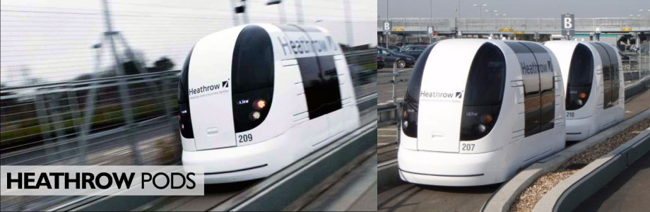

# 

>* Heathrow pods funcionan desde el 2011, pero solo se han utilizado para trasportarse por los terminales. Son eléctricos y autónomos. Son cápsulas pequeñas para máximo 4 personas.
>* Con esta idea podríamos aumentarla a un nivel nacional, siendo el medio de transporte desde los trabajos hasta la playa, conectando el país y ahorrando combustible fósil y contaminante. Además con menos personas en el vehiculo se disminuyen las probabilidades de contagio de cualquier enfermedad o virus.

<!---
Referente Javiera Asfura
-->

