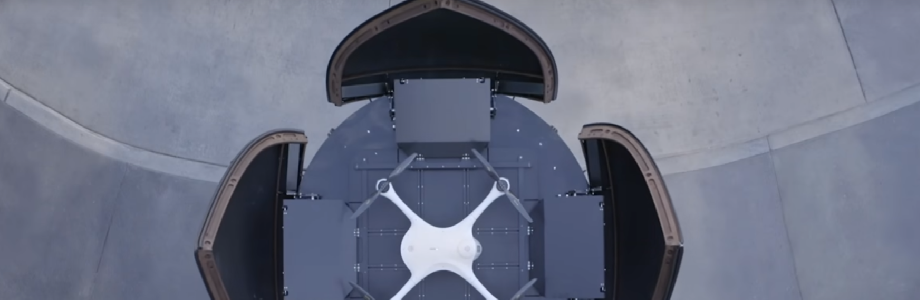

# 

# movilidad-emergencia

[Futuro del transporte 2050 (video)](https://www.youtube.com/watch?v=CUS2w4y2Qj4) - Video de futuros posibles del transporte para el 2050.
# 
>* En este video se muestran realidades futuras del transporte con un claro enfoque en el individuo por sobre la colectividad. Se exploran futuros de Uber. Llama la atención el cuidado por los modelos 3D y sus render, como el desarrollo de cada interfaz de los servicios expuestos. Es importante destacar que se hace más bien referencias al lujo y al comfort indivudual de sociedades desarrolladas, sería importante conocer en un sentido más amplio e inclusivo los alcances de este tipo de avances.
>* En este video se muestran realidades futuras del transporte con un claro enfoque en el individuo por sobre la colectividad. Se exploran futuros de Uber. Llama la atención el cuidado por los modelos 3D y sus render, como el desarrollo de cada interfaz de los servicios expuestos. Es importante destacar que se hace más bien referencias al lujo y al comfort indivudual de sociedades desarrolladas, sería importante conocer en un sentido más amplio e inclusivo los alcances de este tipo de avances..

<!---
Referente Pedro Garretón
-->

[Drone Medico (video)](https://hitconsultant.net/2020/03/10/matternet-secure-medical-drone-delivery-portal-hospitals/#.XoSqLZNKhTZ) - Drone
# 
>* Comentarios del Referente.

<!---
Referente Pedro Garretón
-->

[Aerolineas electricas (video)](https://tecno.americaeconomia.com/articulos/aviones-electricos-el-futuro-de-la-aeronautica) - Drone
# 
>* Comentarios del Referente.
Cada día necesitamos que nuestra energía producida sea más responsable. Hoy la automatización y el despertar de la energía eléctrica. Hoy ya hay privados que se están encargando de cambiar estrategias de inversión y repensar el trasporte de las aerolíneas.La organización de aviación civil internacional estima que, para  el 2050, las emisiones de gases de los aviones se podría triplicar en volumen, a la vez el 4% de gases invernadero pertenecen a los aviones

<!---
Referente Nico Sanhueza
-->

## Consideraciones
- Las imagenes deben ser subidas en .png, 96dpi máximo, 920x300 px.
- Cada alumno debe subir al menos 5 referentes con su respectivo comentario.
- El taller debe proponer categorías para organizar el listado de software e implementarlo.

