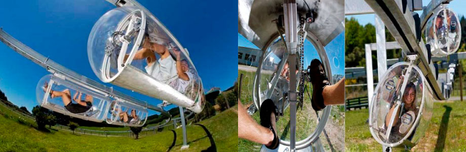

# 

# movilidad-emergencia

[Futuro del transporte 2050 (video)](https://www.youtube.com/watch?v=CUS2w4y2Qj4) - Video de futuros posibles del transporte para el 2050.
# 
>* En este video se muestran realidades futuras del transporte con un claro enfoque en el individuo por sobre la colectividad. Se exploran futuros de Uber. Llama la atención el cuidado por los modelos 3D y sus render, como el desarrollo de cada interfaz de los servicios expuestos. Es importante destacar que se hace más bien referencias al lujo y al comfort indivudual de sociedades desarrolladas, sería importante conocer en un sentido más amplio e inclusivo los alcances de este tipo de avances.
>* En este video se muestran realidades futuras del transporte con un claro enfoque en el individuo por sobre la colectividad. Se exploran futuros de Uber. Llama la atención el cuidado por los modelos 3D y sus render, como el desarrollo de cada interfaz de los servicios expuestos. Es importante destacar que se hace más bien referencias al lujo y al comfort indivudual de sociedades desarrolladas, sería importante conocer en un sentido más amplio e inclusivo los alcances de este tipo de avances..

<!---
Referente Pedro Garretón
-->

[Drone Medico (video)](https://hitconsultant.net/2020/03/10/matternet-secure-medical-drone-delivery-portal-hospitals/#.XoSqLZNKhTZ) - Drone
# 
>* Comentarios del Referente.

<!---
Referente Pedro Garretón
-->

[Cyclotron Bike](https://www.youtube.com/watch?v=XAk6Nt1G5YU) - Cyclotron Bike
# 
>* Bici eléctrica que facilita la movilidad de cortos y largos trayectos. Eco amigable y asequible. Somos seres que necesitan estar en movimiento, cada día tenemos menos tiempo para hacer deporte, por lo que movilizándonos en bicicleta aprovecharemos de realizar actividad física todos los días. A diferencia de los vehículos motorizados, Cyclotron incentiva el deporte y disminuirá los porcentajes de sobrepeso en la población. 
<!---
Referente Victoria Roi
-->

[Elon's Musk Boring Tunnel (video)](https://www.youtube.com/watch?v=u5V_VzRrSBI) - Elon's Musk Boring Tunnel
# 
>* El objetivo de The Boring Company es aliviar las dificultades del tráfico en las ciudades debido a las limitadas capacidades de su las redes de transporte en superficie. El CEO del fabricante de vehículos eléctricos Tesla prometió que pondría en marcha una empresa tuneladora para solucionar este problema. Durante estos dos últimos años, la compañía ha estado trabajando en un proyecto en Las Vegas que se convertirá en el primero que tenga continuidad comercial. Las Vegas Convention and Visitors Authority (LVCVA) encargó el proyecto, que debería completarse este mismo año.
>* Con el inicio de 2020, la compañía de excavación e infraestructuras de Musk está a punto de completar el primero de sus túneles comerciales en Las Vegas que, con una longitud de una milla (1,6 kilómetros), se extiende desde el Centro de Convenciones de Las Vegas hasta el Strip. El túnel que está finalizando la compañía está específicamente diseñado para su uso únicamente por vehículos eléctricos (no solo Tesla) puesto que en ellos no puede haber presencia de vapores tóxicos, ya que no cuenta con un sistema para extraerlos que lo encarecería sensiblemente.
>* Es interesante este proyecto porque propone un sistema de transporte que funciona en base a un sistema o un componente ya existente en las ciudades que en este caso son los vehículos. Estos túneles más que un aparato o elemento clave proponen un sistema de funcionamiento que mejora el funcionamiento de los vehículos en la ciudad. Si bien, The Boring Tunnel está pensado para aliviar la extrema congestión del tráfico en la ciudad, es clave la idea de utilizar un componente ya existente y disponerlo en otro contexto para aumentar su utilidad. 
>* En el contexto del Covid-19 que estamos viviendo en la actualidad, la movilidad de las ciudades en su amplio espectro de comprensión se ha visto limitada por las necesarias cuarentenas y políticas públicas restrictivas que buscan aplanar la curva de contagio. ¿Cómo entonces tomamos lo ya existente para mejor su utilidad en base al desplazamiento de su contexto? Podríamos por ejemplo pensar en el metro subterráneo como sistema de distribución de bienes primarios, o podríamos pensar en las micros como módulos comerciales móviles, etc. 

<!---
Referente de Christian Ortiz
-->

[GET READY FOR THE E-RIDE OF YOUR LIFE (video)](https://www.youtube.com/watch?v=1yNZ4J-Wflo-) Scooter todoterreno
# 
>* Este scooter eléctrico es de la empresa Moby Products, que puede ser utilizado en diferentes superficies, desde la ciudad hasta la arena de la playa. YX One utiliza el peso corporal para controlar el vehículo. En la actualidad puede ser una buena opción para evitar los medios de transporte masivos y lograr movilidad sin tener que compartir el espacio.
>* En el video se puede observar la versatilidad de éste scooter que puede facilitar en gran medida el transporte diario en donde se puede avanzar hasta 60 km/hr.

<!---
Referente Javiera Asfura
-->

[Futuro del Transporte 2050 (video)](https://www.youtube.com/watch?v=CUS2w4y2Qj4) - Video de futuros posibles del transporte para el 2050.
# 
>* En este video se muestra una nave de virgin galactic por primera vez en el espacio en el 2018 .
>* Podría ser realidad una nueva forma de movilidad en el futuro, donde al encontrarse el planeta tierra infectado por virus y personas contagiadas, se deben proteger muy bien a las personas sanas y eventualmente podria comenzar una nueva movilidad de personas de la tierra al espacio mientras se encuentra una cura.

<!---
Referente María Ignacia Alcaino
-->

[Transporte Futuro en Frasco](http://surdaka.blogspot.com/2009/07/el-transporte-del-futuro-es-en-un.html) - frasco
# 
>* Aqui se puede ver como este referente del año 2009, buscaba ser un medio de transporte personal, el cual es muy atingente a lo que se vive hoy con el coronavirus, y cabe destacar que es un transporte autonomo ya que funciona como una bicicleta.

<!---
Referente Max Pino
-->

[Drone Delivey (video)](https://www.youtube.com/watch?v=pzi7vqGos6U) - Video Mockup - Zeppelin Delivery Amazon.
# 

>* Concepto de delivery a través de un zepellin que lleva una carga de drones con paquetes en su interior. Si bien el delivery de drones esta siendo utilizado por la compañía Amazon por su pagina llamada "Prime Air", no esta optimizada en ningún ámbito, como en interacción con el cliente, ni en la movilización del mismo dron.
>* Si bien es un concepto utilizado por Amazon basado en sus ventas, se podría extrapolar facilmente en la distribución de articulos de necesidades básicas y artículos medicos.
>* Dado a los brotes del virus CODVID-19, esta forma de dristribución de bienes podría ayudar a la aislación de personas en cuarentena, al igual que al acceso a zonas de difícil conexión.

<!---
Referente Pablo Cortés
-->

[Aerolineas electricas (video)](https://tecno.americaeconomia.com/articulos/aviones-electricos-el-futuro-de-la-aeronautica) - Drone
# 
>* Comentarios del Referente.
Cada día necesitamos que nuestra energía producida sea más responsable. Hoy la automatización y el despertar de la energía eléctrica. Hoy ya hay privados que se están encargando de cambiar estrategias de inversión y repensar el trasporte de las aerolíneas.La organización de aviación civil internacional estima que, para  el 2050, las emisiones de gases de los aviones se podría triplicar en volumen, a la vez el 4% de gases invernadero pertenecen a los aviones

<!---
Referente Nico Sanhueza
-->

[Diagnostico Preciso (video)](https://www.youtube.com/watch?v=EZZUwU9ZRsQ) - Medicina del futuro
# 
>* Tomando como referencia a Black Panter de Marvel, nos encontramos con Wakanda una ciudad altamente tecnologica en la que tanto las armas, como la ciudad y la medicina estan a la vanguardia del mundo.
En el laboratorio de Shuri, Ross es examinado y vemos retroalimentación biométrica de varias formas que se muestran en la pantalla y en forma holográfica, la proyección holográfica del área dañada de la columna vertebral permite dar un diagnostico sin someterse a distintos examenes un tanto lentos e inexactos.  Los accidentes nos expoenen a ser sumamente vulnerables y el factor tiempo es algo que corre en contra cuando se trata de salvar una vida o en el caso de una comunidad, evitar que se de el colapso del sistema de salud debido a que los examenes son lentos y se tiene pocos equipos.
[SwordArtOnline](http://experienceperception.com/black-panther-fui.html) se hace cargo de la exploración de la tecnologia en wakanda

[Inside Out (video)](https://www.youtube.com/watch?v=EZZUwU9ZRsQ) - Nuestros recuerdos
# 
>* Nuestra mente y nuestros recuerdos, cómo se clasifican y cómo podemos viasualizar todos esos recuerdos. La gnosis, terapias y sesiones psicológicas apuntan a poder recordar momentos traumáticos y explicar el impacto en nuestro comportamiento. ¿Que tal si podríamos decifrar la manera en que nuestro cerebro ordena todo esto? Después de todo ningún computador ha logrado ser como nuestra mente.

[Big Hero 6 (video)](https://www.youtube.com/watch?v=EZZUwU9ZRsQ) - Contención médica
# 
>* Robot con atención médica, Baymax está programado con un chip para el servicio médico, atiende con paciencia a los pacientes y le es importante dar un buen servicio. Su diagnóstico es preciso ya que sus ojos son un escaneo directo a tu cuerpo y logra detectar las dolencias de esa manera, te permite evaluar el dolor en base a una tabla. Este robot logra entregar confianza y es sensible respecto a el estafo del paciente.

[La Familia del Futuro (video)](https://www.youtube.com/watch?v=EZZUwU9ZRsQ) - Maquina de recuerdos 
# 
>* La familia del futuro, la máquina que permite volver a ver tus recuerdos desde la fecha y hora.
Nuestro cerebro logra almacenar mucha información y aquí el referente da la importancia de nuestros recuerdos y logra proyectarlos en una pantalla, ¿que es aquello que nos hace humanos? ¿Donde queda todo nuestro aprendizaje y recordar nuestras experiencias? Aquí una cámara logra ser el acercamiento a congelar un momento de nuestra vida, pero ¿cómo logramos ver todos los recuerdos de nuestra memoria?

[Planeta del tesoro (video)](https://www.youtube.com/watch?v=lFG9YNz9Q20&feature=youtu.be) - Mapa de los mil mundos
# 
>* La esfera que persiguen los piratas galácticos es un mapa que logra insertarse en un planeta y que logra abrir portales a cualquier lugar del espacio, el usuario de esa esfera robaba en la galaxia y ocultaba su tesoro en su propio planeta. El futuro se ve como un lugar en donde los portales si son algo posible y que facilitan perder moverse espontáneamente de un lugar a otro y en este caso con expediciones o vehículos de gran tamaño con grupos de personas numerosas.

[Robots (video)](https://www.youtube.com/watch?v=EZZUwU9ZRsQ) - Reinventarse
# 
>*Nuestra necesidades son distintas desde nuestro contexto socioeconómico, por lo que si bien esta se presenta como una necesidad robot, se pone sobre la mesa la importancia de reparar y la importancia de conocerse mejor. El futuro antes se veia como algo frio y distante pero el humano tiene la necesidad de humanizarse aun mas, generar empatia y conexion con su entorno. "No importa de lo que estes hecho, puedes brillar"

<!---
Gabriela Arisel
-->

[Amusphere](https://www.youtube.com/watch?v=IBlpodGjBLU) - Mind control technology.
# 
>* En este video se muestra como la tecnologia esta más cerca del control de objetos mediante nuestra mente. Un referente claro de donde surgió esta idea es una saga de anime llamada [SwordArtOnline](https://www.youtube.com/watch?v=W7SzlqdrkbA) 

<!---
Referente Ignacio Zuñiga
-->

[Elévate (+ info)](https://www.hyundainews.com/en-us/releases/2680) - Elevate, el Vehículo de movilidad máxima.
# 
>* Hyundai dio a conocer su concepto para un automóvil andante llamado Elévate, el vehículo tendría patas robóticas extensibles, lo que le permitiría negociar terrenos peligrosos e irregulares.  
El fabricante de automóviles de Corea del Sur afirma que el vehículo podría ayudar a los trabajadores de emergencia a rescatar a las personas en áreas de difícil acceso, además de ser adecuado para su uso en las ciudades. Con sus largas patas robóticas, el Elévate está diseñado para conducir, caminar o escalar el terreno más traicionero, al que los vehículos normales no pueden acceder.
Lo más emocionante de este proyecto es que no solo tienen capacidad para ayudar en emergencias si no que también para adaptarse parea personas discapacitadas, aproximándose a ellos sin necesitar de sus esfuerzos o rampas), como también podrá modificarse levemente para usase en exploraciones en el espacio, en visitas a diversos planetas que muchas veces cuentan con suelos duros o irregulares.

[Perro robotico (video)](https://www.youtube.com/watch?v=ssrk9bW2xBk) - Este perro de entrega robot
# 
>* Este perro robótico, que te entrega tus paquetes directamente a su puerta, fue hecho por la compañía automotriz alemana Continental. No puedo evitar pensar en sustituir en zonas rurales animales de carga con este perro robótico ya que podría llevar elementos pesados y podría ajustarse para zonas rocosas o complejas.

[Silla de rueda inteligente (video)](https://www.youtube.com/watch?v=6LfE3mQzLNY&feature=emb_logo) - Silla inteligente
# 
>*La nueva empresa brasileña Hoobox Robotics ha colaborado con Intel para producir un kit adaptador que permite que casi cualquier silla de ruedas eléctrica sea controlada por las expresiones faciales del usuario. El kit equipa una silla de ruedas con inteligencia artificial para detectar las expresiones del usuario y procesar los datos en tiempo real para dirigir el movimiento de la silla.
El reconocimiento que lograron generar se podría escalar para las señas que se realizan en el LGCH o de otros países, y no solo eso sino que impedir gestos obscenos en videos u otros con el simple recogimiento además de darle a las maquinas la habilidad de entender nuestros gestos entre otros.

[Escudo individual vs covid-19](https://www.dezeen.com/2020/02/26/sun-dayong-coronavirus-protection-shield/?li_source=LI&li_medium=bottom_block_1) - Silla inteligente
# 
>*El arquitecto chino Sun Dayong creo un diseño conceptual para un escudo corporal que protegería a un usuario durante un brote de coronavirus utilizando luz UV para esterilizarse. Llamado Be a Bat Man, el dispositivo de seguridad móvil.
Después de contener una epidemia, piensa que los escudos tipo murciélago podrían actualizarse con la tecnología Google Glass, o simplemente usarse como un "espacio móvil privado único para las personas".
Es curioso que ven esta barrera como algo para una persona... ¿Por qué no verlo para uso más masivo? ¿tal vez una barrera para una ciudad u edificio? esta tecnología se podría escalar aún más.

<!---
Referente Carolina Bustamante
-->

## Consideraciones
- Las imagenes deben ser subidas en .png, 96dpi máximo, 920x300 px.
- Cada alumno debe subir al menos 5 referentes con su respectivo comentario.
- El taller debe proponer categorías para organizar el listado de software e implementarlo.

