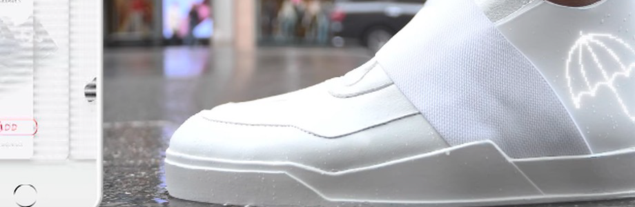
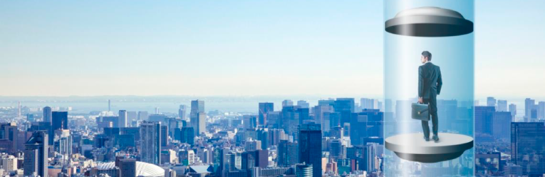
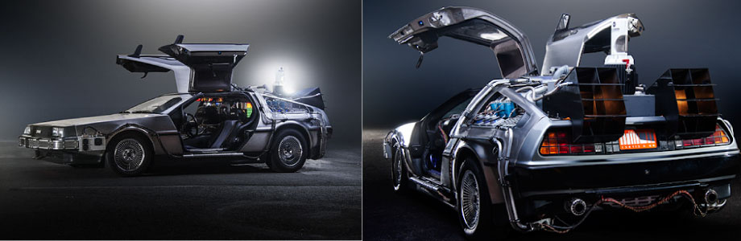
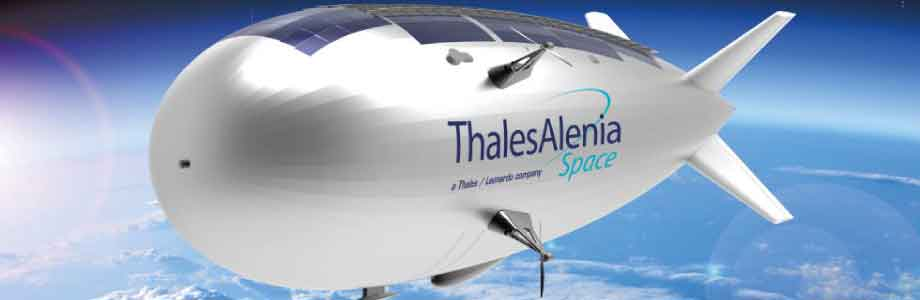

# 

# Movilidad Emergencia - Referentes Taller Integrado MID UAI 2020

[Futuro del transporte 2050 (video)](https://www.youtube.com/watch?v=CUS2w4y2Qj4) - Video de futuros posibles del transporte para el 2050.
# 
>* En este video se muestran realidades futuras del transporte con un claro enfoque en el individuo por sobre la colectividad. Se exploran futuros de Uber. Llama la atención el cuidado por los modelos 3D y sus render, como el desarrollo de cada interfaz de los servicios expuestos. Es importante destacar que se hace más bien referencias al lujo y al comfort indivudual de sociedades desarrolladas, sería importante conocer en un sentido más amplio e inclusivo los alcances de este tipo de avances.
>* En este video se muestran realidades futuras del transporte con un claro enfoque en el individuo por sobre la colectividad. Se exploran futuros de Uber. Llama la atención el cuidado por los modelos 3D y sus render, como el desarrollo de cada interfaz de los servicios expuestos. Es importante destacar que se hace más bien referencias al lujo y al comfort indivudual de sociedades desarrolladas, sería importante conocer en un sentido más amplio e inclusivo los alcances de este tipo de avances..

<!---
Referente Pedro Garretón
-->

<!-- [Drone Medico (video)](https://hitconsultant.net/2020/03/10/matternet-secure-medical-drone-delivery-portal-hospitals/#.XoSqLZNKhTZ) - Drone
# 
>* Comentarios del Referente. -->

<!---
Referente Pedro Garretón
-->

[Cyclotron Bike](https://www.youtube.com/watch?v=XAk6Nt1G5YU) - Cyclotron Bike
# 
>* Bici eléctrica que facilita la movilidad de cortos y largos trayectos. Eco amigable y asequible. Somos seres que necesitan estar en movimiento, cada día tenemos menos tiempo para hacer deporte, por lo que movilizándonos en bicicleta aprovecharemos de realizar actividad física todos los días. A diferencia de los vehículos motorizados, Cyclotron incentiva el deporte y disminuirá los porcentajes de sobrepeso en la población. 

[Multicoaster](https://engineered.thyssenkrupp.com/en/multicoaster-revealed-introducing-the-roller-coaster-of-tomorrow/) - MULTIcoaster
# 
>* Como una montaña rusa alrededor de la ciudad. Son unidades separadas que transportan a una persona o familia pequeña. El usuario es capaz de elegir su ruta una vez que entró a la compuerta, entregando una experiencia única en cada viaje. Para prevenir choques y accidentes, contiene un sistema con inteligencia artificial que coordina el conjunto de viajes. Cada cabina puede avanzar hacia atras y adelante, lo que amplía las posibilidades de trayectos. Viajar en montaña rusa desde tu casa hacia tu trabajo, de manera ecoamigable y mucho más rápida que el metro.
>* La idea de que sean cabinas separas que transportan solo a personas que viven juntas, ayuda a disminuir el contagio de enfermedades e incentiva el aislamiento. Cada cubículo tiene la tecnología necesaria para investigar el aire de su espacio, por lo que se lleva un control preciso si aparece una persona enferma o con un virus. Así se aisla inmediatamente al ser humano y se evita la propagación de la enfermedad.  

[Caminando sobre el agua](https://www.youtube.com/watch?v=KB-7doKro_0) - Caminando sobre el agua
# 
>* Debido a la obligación de no contacto con los demás, esta movilización será una opción efectiva para llevar al mínimo el traspaso de virus de manera física. Además al considerar el aumento del nivel del mar durante los próximos años, muchas ciudades estarán sumergidas y transportarse de un lugar a otro utilizando estas esferas será mucho más factible y asequible para todos.    

[Zapatillas del futuro](https://www.businessinsider.es/zapatillas-futuro-seran-reciclables-contaran-pasos-474027) - Zapatillas del futuro
# 
>* Zapatillas ecoamigables: 100% reciclables  creadas con un ciclo completamente cerrado. Biofibras de algas que pueden hacer que las zapatillas crezcan, así se reduce la compra constante de nuevas zapatillas debido a cambios de talla.  
>*En cuanto a los estados de emergencia los pasos serán rastreados gracias a las zapatillas. De esta manera se llevará un mapa de los pasos que cada personas hace, para lograr tener un control total durante las cuarentenas y toques de queda.     

[Postmodern Skateboard](https://www.youtube.com/watch?v=YiK0RD7WGGI) - Postmodern Skateboard
# 
>* Para poder seguir realizando skateboard, pero avanzar más rápido. Dos ruedas no conectadas, al moverse con el cuerpo hacia adelante avanzan, así sin importar la experiencia ni la edad del usuario todos pueden aprender. Al considerar situaciones de emergencia, moverse con el postmodern skateboard ayudará a incentivar la movilización unitaria y la independencia. De esta manera los números de contagiados de todo tipo de enfermedades bajarán.          

[Ascensor espacial](https://www.technologyreview.es/s/11458/el-futuro-viaje-de-la-tierra-la-luna-bordo-de-un-ascensor-espacial) - Ascensor espacial
# 
>* Un ascensor que nos llevará al espacio debido al mal estado en el que dejamos la tierra. Las nuevas enfermedades creadas por el ser humano, debido al consumo de animales, nos obligaron a escapar a otros planetas y volverlos habitables. No fuimos capaces de encontrar curas para los virus, y las medidas de aislamiento no fueron suficientes para combatir y superar las situaciones de emergencia. 
>* Este ascensor es alimentado por energía solar y se mantiene en funcionamiento por las fuerzas centrífugas. Los primeros viajes serán hacia la luna, el túnel colgará desde allá hacia la tierra. Así orbitaría solo una vez al mes.  

[Megacities](https://engineered.thyssenkrupp.com/en/life-above-the-smog/) - Sobre el smog
# 
>* Debido a las grandes concentraciones de smog en las ciudades más populares, éstas se verán obligadas a trasladarse hacia arriba. Por lo que se construirán  ciudades modulares sobre los espacios actuales. Estos lugares estarán sobre la contaminación y serán sustentables para preservar el aire limpio. No habrá más movilización del ser humano de un lugar hacia otro, gracias al internet no será necesario salir de las casas para realizar compras ni para trabajar. Ésto disminuirá al máximo el contacto físico entre las personas, lo que conlleva al aislamiento constante, asímismo no habrán más contagios de enfermedades. Al descubrir un nuevo virus éste se quedará dentro de la casa del infectado hasta su total extinción.            

<!---
Referente Victoria Roi
-->

[Elon's Musk Boring Tunnel (video)](https://www.youtube.com/watch?v=u5V_VzRrSBI) - Elon's Musk Boring Tunnel
# 
>* El objetivo de The Boring Company es aliviar las dificultades del tráfico en las ciudades debido a las limitadas capacidades de su las redes de transporte en superficie. El CEO del fabricante de vehículos eléctricos Tesla prometió que pondría en marcha una empresa tuneladora para solucionar este problema. Durante estos dos últimos años, la compañía ha estado trabajando en un proyecto en Las Vegas que se convertirá en el primero que tenga continuidad comercial. Las Vegas Convention and Visitors Authority (LVCVA) encargó el proyecto, que debería completarse este mismo año.
>* Con el inicio de 2020, la compañía de excavación e infraestructuras de Musk está a punto de completar el primero de sus túneles comerciales en Las Vegas que, con una longitud de una milla (1,6 kilómetros), se extiende desde el Centro de Convenciones de Las Vegas hasta el Strip. El túnel que está finalizando la compañía está específicamente diseñado para su uso únicamente por vehículos eléctricos (no solo Tesla) puesto que en ellos no puede haber presencia de vapores tóxicos, ya que no cuenta con un sistema para extraerlos que lo encarecería sensiblemente.
>* Es interesante este proyecto porque propone un sistema de transporte que funciona en base a un sistema o un componente ya existente en las ciudades que en este caso son los vehículos. Estos túneles más que un aparato o elemento clave proponen un sistema de funcionamiento que mejora el funcionamiento de los vehículos en la ciudad. Si bien, The Boring Tunnel está pensado para aliviar la extrema congestión del tráfico en la ciudad, es clave la idea de utilizar un componente ya existente y disponerlo en otro contexto para aumentar su utilidad. 
>* En el contexto del Covid-19 que estamos viviendo en la actualidad, la movilidad de las ciudades en su amplio espectro de comprensión se ha visto limitada por las necesarias cuarentenas y políticas públicas restrictivas que buscan aplanar la curva de contagio. ¿Cómo entonces tomamos lo ya existente para mejor su utilidad en base al desplazamiento de su contexto? Podríamos por ejemplo pensar en el metro subterráneo como sistema de distribución de bienes primarios, o podríamos pensar en las micros como módulos comerciales móviles, etc. 

<!---
Referente de Christian Ortiz
-->

[GET READY FOR THE E-RIDE OF YOUR LIFE (video)](https://www.youtube.com/watch?v=1yNZ4J-Wflo-) Scooter todoterreno
# 
>* Este scooter eléctrico es de la empresa Moby Products, que puede ser utilizado en diferentes superficies, desde la ciudad hasta la arena de la playa. YX One utiliza el peso corporal para controlar el vehículo. En la actualidad puede ser una buena opción para evitar los medios de transporte masivos y lograr movilidad sin tener que compartir el espacio.
>* En el video se puede observar la versatilidad de éste scooter que puede facilitar en gran medida el transporte diario en donde se puede avanzar hasta 60 km/hr.

Transporte en Pods privados
# 

>* Heathrow pods funcionan desde el 2011, pero solo se han utilizado para trasportarse por los terminales. Son eléctricos y autónomos. Son cápsulas pequeñas para máximo 4 personas.
>* Con esta idea podríamos aumentarla a un nivel nacional, siendo el medio de transporte desde los trabajos hasta la playa, conectando el país y ahorrando combustible fósil y contaminante. Además con menos personas en el vehiculo se disminuyen las probabilidades de contagio de cualquier enfermedad o virus.

Hyperloop es un nuevo tipo de tren que circula dentro de un tubo de vacío a más de 1.000 kilómetros por hora
# 

>* Este tren busca entregar un tranporte rápido que conectaría a New York y Washington en 30 minutos, con hasta 28 personas. 
>* EN la acualidad el tiempo es una de las cosas más vaiosas que poseemos, es por esto que la idea de un tren a ésta velocidad parecería futurista pero no absurda, ya que resolvería muchos problemas de tiempo y tráfico.

Máquina del tiempo DeLorean
# 

>* Es un artefacto ficticio de la película volver al futuro, en donde utilizan este vehiculo para viajar por el tiempo y así cambiar cosas del pasado o prevenir cosas del futuro.
>* Éste artefacto podría ser útil en la actualidad para volver al pasado y así detener la pandemía del coronavirus, o ir al futuro y obtener la cura de éste virus.

[Submarinos civiles e individuales]
# 

>* Los submarinos civiles son mas pequeños que los militares, tienen capacidad entre 25 y 50 pasajeros y tienen un diseño variable dependiendo de las circunstancias en las que se utilicen.
>* Éste artefacto podría ser útil para el transporte de pasajeros por debajo del mar, de ésta forma podemos evitar el contacto con personas y contaminación de otros medios de transporte. En los casos de submarinos individuales hasta 4 personas se pueden utilizar para transportarse seguro sin tener que tener contácto con otras personas.

<!---
Referente Javiera Asfura
-->

[Futuro del Transporte 2050 (video)](https://www.youtube.com/watch?v=CUS2w4y2Qj4) - Video de futuros posibles del transporte para el 2050.
# 
>* En este video se muestra una nave de virgin galactic por primera vez en el espacio en el 2018 .
>* Podría ser realidad una nueva forma de movilidad en el futuro, donde al encontrarse el planeta tierra infectado por virus y personas contagiadas, se deben proteger muy bien a las personas sanas y eventualmente podria comenzar una nueva movilidad de personas de la tierra al espacio mientras se encuentra una cura.

[BALLIE ROBOT (video)](https://www.youtube.com/watch?time_continue=81&v=Xwi_U-g3wA0&feature=emb_logo) - Ballie Samsung Robot.
# 
>* En este video se muestra un robot lanzado por Samsung, el cual ayuda con distintas tareas en la casa, tales como levantar a la persona, encender la aspiradora cuando es necesario, entretener a una mascota, y hacer compañía.
>* Podría ser muy útil actualmente para personas que viven solas y se encuentran enfermas y no tienen quien los ayude con las tareas de la casa, o simplemente para personas que viven solas, y no tienen mascotas y necesitan compañía.

[DRONE DELIVERY (video)](https://www.youtube.com/watch?v=EZ4uczr19io) - Dragonfly Drone Delivery.
# 
>* En este video se muestra un prototipo de delivery a través de drone. La base donde se encuentran los productos que deben ser entregados, se encuentran en un tipo de plataforma en el mar.
>* Podría ser muy útil actualmente para las entregas, tanto de medicinas como productos comprados por internet, donde se evita la circulación de personas, a parte de ser mas rápido y efectivo y menos contaminante.

<!---
Referente María Ignacia Alcaino
-->

[Transporte Futuro en Frasco](http://surdaka.blogspot.com/2009/07/el-transporte-del-futuro-es-en-un.html) - Frasco
# 
>* Aqui se puede ver como este referente del año 2009, buscaba ser un medio de transporte personal, el cual es muy atingente a lo que se vive hoy con el coronavirus, y cabe destacar que es un transporte autonomo ya que funciona como una bicicleta.

[cyclotron](https://www.marketingdirecto.com/digital-general/digital/que-tiemble-uber-futurista-bicicleta-electrica-podria-taxi-futuro) 
# 
>* Proxima bicicleta altamente segura, que pretendería ser un taxi con espacio para dos personas, guiada por la IA en el que se pinesa de nuevo en la individualidad, pero también en la seguridad.

[silla de ruedas del futuro](https://www.airwheel.net/sp/news/17664)
# 
>* Esta silla plantea seguir solucionando problemas de inclusión, con sus avances pueden ser dde gran ayuda ayuda para la autonomía que busca una persona con problemas de movilidad, sobre todo en este nuevo mundo.

[Traje astronauta](https://peru21.pe/vida/z-2-traje-astronautas-iran-marte-156824-noticia/?ref=p21r)
# 
>* Quizas pensado para viajar al espacio y arrivar en marte, pero para la crisis sanitaria que se vive hoy puede abrir una pyerta una idea como esta adaptada al uso cotidiano, para l alibre circulación ante problemas en distintas zonas del planeta.

[autovolador](https://parabuenosaires.com/autos-voladores-el-futuro-del-transporte/) 
# 
>* Mas que un auto volador, este propone un auto flotador, que transita libremente, con innovafores sistemas de seguridad para evitar choques y otros tipos de accidentes.

<!---
Referente Max Pino
-->

<!---
Referente Max Pino
-->

[Drone Delivey (video)](https://www.youtube.com/watch?v=pzi7vqGos6U) - Video Mockup - Zeppelin Delivery Amazon.
# 

>* Concepto de delivery a través de un zepellin que lleva una carga de drones con paquetes en su interior. Si bien el delivery de drones esta siendo utilizado por la compañía Amazon por su pagina llamada "Prime Air", no esta optimizada en ningún ámbito, como en interacción con el cliente, ni en la movilización del mismo dron.
>* Si bien es un concepto utilizado por Amazon basado en sus ventas, se podría extrapolar facilmente en la distribución de articulos de necesidades básicas y artículos medicos.
>* Dado a los brotes del virus CODVID-19, esta forma de dristribución de bienes podría ayudar a la aislación de personas en cuarentena, al igual que al acceso a zonas de difícil conexión.

[Hydrofoil Bike (video)](https://www.youtube.com/watch?v=Ihc92mldu60) - Bicicleta eléctrica basado en Hydrofoil.
# 

>* Manta 5 nos muestra como se puede reinventar la movilización acuatica en base a tecnología hydrofoil, la cual se sustenta en la reducción de roce con el agua mejorando eficientemente la energía gastada al momento de mover un objeto.
>* Al estar pensada de una manera eficiente, la movilización puede evolucionar a una manera más veloz y mas sustentable energeticamente.

["The Surrogates" (video)](https://www.youtube.com/watch?v=UGwQ74cH5O0) - Sustitutos del cuerpo orgánico.
# 

>* La película basa en un comic nos muestra como las personas dejan su cuerpo orgánico por cuerpos mecánicos para hacer su día a día.
>* Nos muestra como la percepción del cuerpo frágil va aumentando, por lo que las personas empiezan a elegir no salir tal como ellos, si no que inventan este "escudo" que los hace sentir a salvo.
>* En un futuro (utópico o distópico), van a aumentar el porcentaje de enfermedades emergentes, por lo que vamos a tener que encontrar alternativas fuera de lo común para poder hacer nuestro día cotidiano.

[(Un)Natural Selection (video)](https://www.youtube.com/watch?v=WIIVh7H6nvI) - Futuro del Bio-Hacking.
# 

>* La exploración de nuestro cuerpo determina nuevas variantes a la misma composición órganica. Con el concepto de bio hacking nacen (aunque ya hace bastante tiempo) nuevas contradicciones éticas sobre que debemos y que podemos hacer al momento de modificar la naturaleza.
>* La visión a largo plazo de la modificación genética nos podría llevar a mejorar nuestros cuerpos en términos de salud, conectándonos orgánicamente con la tecnología eléctrica, o hasta nuestros colores de ojo. Al mismo tiempo se puede direccionar hacia la modificación de especies, tal como los mosquitos, para quitarles el factor vectorial de muchas enfermedades que esparcen.

[Rivian Trucks (video)](https://www.youtube.com/watch?v=QMfxJEfb4lw) - Camioneta 100% electrica.
# 

>* La tecnología en movilización nos muestra nuevamente la supremacía de los autos eléctricos por sobre los de combustión. Si bien ya todos conocemos la tecnología, la empresa Rivian nos muestra como se extrapola la visión de auto eléctrico a lo todo terreno.
>* Los modelos de autos creados por la empresa nos muestra la eficiencia de los motores eléctricos, como superan en comparación a otras camionetas de alta gama pero de combustión. El espacio que se gana gracias a que los motores se encuentran en las mismas ruedas nos puede llevar a pensar como se puede administrar realmente el espacio de un auto, dejando de lado la idea de el capo frontal conteniendo el motor.

<!---
Referente Pablo Cortés
-->

[Aerolineas electricas (video)](https://tecno.americaeconomia.com/articulos/aviones-electricos-el-futuro-de-la-aeronautica) - Drone
# 
>* Comentarios del Referente.
Cada día necesitamos que nuestra energía producida sea más responsable. Hoy la automatización y el despertar de la energía eléctrica. Hoy ya hay privados que se están encargando de cambiar estrategias de inversión y repensar el trasporte de las aerolíneas.La organización de aviación civil internacional estima que, para  el 2050, las emisiones de gases de los aviones se podría triplicar en volumen, a la vez el 4% de gases invernadero pertenecen a los aviones

[Stratobus (video)](https://www.youtube.com/watch?v=nvmkendJI2Y) - Thales alenia stratobus
# 
>* Comentarios del Referente.
Hoy la ingeneria de los satelites es importante para el estilo de vida que vivimos, pero su baja vulnerabilidad, y vida util a generado una gran acumulacion de desechos espaciales . dibido a esto que es importante remplantear el modo de trabajo que se esta desarrollando. L a empresa thales Alenia space esta desarrollando stratobus que esta diseñado para proporcionar informacion de vigilancia maritima , telecomunicaciones etc.. a la vez  imagenes de alta resolucion desde largas doistancias. Es un diseño autonomo que cuenta con energia sustentable 

[Ciududades del futuro  (video)](https://www.youtube.com/watch?v=yLCUAhGaGsk) - Emergencia y transporte 
# 
>* Comentarios del Referente.
Hoy con un ritmo exponencial del crecimiento poblacional que como consecuencia produce cuidades mas congestionadas. el transporte de las instituciones de emergencia se van a ver cada vez mas limitadas en llegar con urgencia a los destinos es por esto que una forma de repensar el traslado es este carro de bomberos que se eleva por encima del trafico. esta lejos de la realidad pero muy serca de replantiarce el traslado de estas instituciones.

[Hyperloop  (video)](https://www.youtube.com/watch?v=tJoFOmCUgvg) - transporte del futuro
# 
>* Comentarios del Referente.
Hyperloop es otro medio de transporte que funciona con tubos al vacio que viaja sin resistencia al aire o a la friccion  trasnportando personas o carga a alta velocidad.

[esight 3 (video)](https://www.youtube.com/watch?v=tJoFOmCUgvg) - anteojos 
# 
>* Comentarios del Referente.
easight3 son unos anteojos que mejoran permite ver a personas con perdida de vision , mejorando la vision 

<!---
Referente Nico Sanhueza
-->

[Diagnostico Preciso (video)](https://www.youtube.com/watch?v=EZZUwU9ZRsQ) - Medicina del futuro
# 
>* Tomando como referencia a Black Panter de Marvel, nos encontramos con Wakanda una ciudad altamente tecnologica en la que tanto las armas, como la ciudad y la medicina estan a la vanguardia del mundo.
En el laboratorio de Shuri, Ross es examinado y vemos retroalimentación biométrica de varias formas que se muestran en la pantalla y en forma holográfica, la proyección holográfica del área dañada de la columna vertebral permite dar un diagnostico sin someterse a distintos examenes un tanto lentos e inexactos.  Los accidentes nos expoenen a ser sumamente vulnerables y el factor tiempo es algo que corre en contra cuando se trata de salvar una vida o en el caso de una comunidad, evitar que se de el colapso del sistema de salud debido a que los examenes son lentos y se tiene pocos equipos.
[SwordArtOnline](http://experienceperception.com/black-panther-fui.html) se hace cargo de la exploración de la tecnologia en wakanda

[Inside Out (video)](https://www.youtube.com/watch?v=EZZUwU9ZRsQ) - Nuestros recuerdos
# 
>* Nuestra mente y nuestros recuerdos, cómo se clasifican y cómo podemos viasualizar todos esos recuerdos. La gnosis, terapias y sesiones psicológicas apuntan a poder recordar momentos traumáticos y explicar el impacto en nuestro comportamiento. ¿Que tal si podríamos decifrar la manera en que nuestro cerebro ordena todo esto? Después de todo ningún computador ha logrado ser como nuestra mente.

[Big Hero 6 (video)](https://www.youtube.com/watch?v=EZZUwU9ZRsQ) - Contención médica
# 
>* Robot con atención médica, Baymax está programado con un chip para el servicio médico, atiende con paciencia a los pacientes y le es importante dar un buen servicio. Su diagnóstico es preciso ya que sus ojos son un escaneo directo a tu cuerpo y logra detectar las dolencias de esa manera, te permite evaluar el dolor en base a una tabla. Este robot logra entregar confianza y es sensible respecto a el estafo del paciente.

[La Familia del Futuro (video)](https://www.youtube.com/watch?v=EZZUwU9ZRsQ) - Maquina de recuerdos 
# 
>* La familia del futuro, la máquina que permite volver a ver tus recuerdos desde la fecha y hora.
Nuestro cerebro logra almacenar mucha información y aquí el referente da la importancia de nuestros recuerdos y logra proyectarlos en una pantalla, ¿que es aquello que nos hace humanos? ¿Donde queda todo nuestro aprendizaje y recordar nuestras experiencias? Aquí una cámara logra ser el acercamiento a congelar un momento de nuestra vida, pero ¿cómo logramos ver todos los recuerdos de nuestra memoria?

[Planeta del tesoro (video)](https://www.youtube.com/watch?v=lFG9YNz9Q20&feature=youtu.be) - Mapa de los mil mundos
# 
>* La esfera que persiguen los piratas galácticos es un mapa que logra insertarse en un planeta y que logra abrir portales a cualquier lugar del espacio, el usuario de esa esfera robaba en la galaxia y ocultaba su tesoro en su propio planeta. El futuro se ve como un lugar en donde los portales si son algo posible y que facilitan perder moverse espontáneamente de un lugar a otro y en este caso con expediciones o vehículos de gran tamaño con grupos de personas numerosas.

[Robots (video)](https://www.youtube.com/watch?v=EZZUwU9ZRsQ) - Reinventarse
# 
>* Nuestra necesidades son distintas desde nuestro contexto socioeconómico, por lo que si bien esta se presenta como una necesidad robot, se pone sobre la mesa la importancia de reparar y la importancia de conocerse mejor. El futuro antes se veia como algo frio y distante pero el humano tiene la necesidad de humanizarse aun mas, generar empatia y conexion con su entorno. "No importa de lo que estes hecho, puedes brillar"

<!---
Gabriela Arisel
-->

[Amusphere](https://www.youtube.com/watch?v=IBlpodGjBLU) - Mind control technology.
# 
>* En este video se muestra como la tecnologia esta más cerca del control de objetos mediante nuestra mente. Un referente claro de donde surgió esta idea es una saga de anime llamada [SwordArtOnline](https://www.youtube.com/watch?v=W7SzlqdrkbA) 

<!---
Referente Ignacio Zuñiga
-->

[Elévate (+ info)](https://www.hyundainews.com/en-us/releases/2680) - Elevate, el Vehículo de movilidad máxima.
# 
>* Hyundai dio a conocer su concepto para un automóvil andante llamado Elévate, el vehículo tendría patas robóticas extensibles, lo que le permitiría negociar terrenos peligrosos e irregulares.  
El fabricante de automóviles de Corea del Sur afirma que el vehículo podría ayudar a los trabajadores de emergencia a rescatar a las personas en áreas de difícil acceso, además de ser adecuado para su uso en las ciudades. Con sus largas patas robóticas, el Elévate está diseñado para conducir, caminar o escalar el terreno más traicionero, al que los vehículos normales no pueden acceder.
Lo más emocionante de este proyecto es que no solo tienen capacidad para ayudar en emergencias si no que también para adaptarse parea personas discapacitadas, aproximándose a ellos sin necesitar de sus esfuerzos o rampas), como también podrá modificarse levemente para usase en exploraciones en el espacio, en visitas a diversos planetas que muchas veces cuentan con suelos duros o irregulares.

[Perro robotico (video)](https://www.youtube.com/watch?v=ssrk9bW2xBk) - Este perro de entrega robot
# 
>* Este perro robótico, que te entrega tus paquetes directamente a su puerta, fue hecho por la compañía automotriz alemana Continental. No puedo evitar pensar en sustituir en zonas rurales animales de carga con este perro robótico ya que podría llevar elementos pesados y podría ajustarse para zonas rocosas o complejas.

[Silla de rueda inteligente (video)](https://www.youtube.com/watch?v=6LfE3mQzLNY&feature=emb_logo) - Silla inteligente
# 
>* La nueva empresa brasileña Hoobox Robotics ha colaborado con Intel para producir un kit adaptador que permite que casi cualquier silla de ruedas eléctrica sea controlada por las expresiones faciales del usuario. El kit equipa una silla de ruedas con inteligencia artificial para detectar las expresiones del usuario y procesar los datos en tiempo real para dirigir el movimiento de la silla.
El reconocimiento que lograron generar se podría escalar para las señas que se realizan en el LGCH o de otros países, y no solo eso sino que impedir gestos obscenos en videos u otros con el simple recogimiento además de darle a las maquinas la habilidad de entender nuestros gestos entre otros.

[Escudo individual vs covid-19](https://www.dezeen.com/2020/02/26/sun-dayong-coronavirus-protection-shield/?li_source=LI&li_medium=bottom_block_1) - Silla inteligente
# 
>* El arquitecto chino Sun Dayong creo un diseño conceptual para un escudo corporal que protegería a un usuario durante un brote de coronavirus utilizando luz UV para esterilizarse. Llamado Be a Bat Man, el dispositivo de seguridad móvil.
Después de contener una epidemia, piensa que los escudos tipo murciélago podrían actualizarse con la tecnología Google Glass, o simplemente usarse como un "espacio móvil privado único para las personas".
Es curioso que ven esta barrera como algo para una persona... ¿Por qué no verlo para uso más masivo? ¿tal vez una barrera para una ciudad u edificio? esta tecnología se podría escalar aún más.

[El traje de masturbación Ripple ofrece ayuda sexual a personas con discapacidad.](https://www.youtube.com/watch?v=kYatDPuhFd4) - Silla inteligente
# 
>* Los diseñadores Hsin-Jou Huang, Szu-Ying Lai y Chia-Ning Hsu ayudan a las personas con discapacidad  a satisfacer sus necesidades sexuales con una herramienta de masturbación de tres partes que incluye un traje, una máscara y un control remoto. El kit de ayuda sexual, llamado Ripple, está diseñado para personas con limitaciones funcionales de moderadas a severas, que requieren cuidadores para ayudarlos en las tareas cotidianas.
Funciona para estimular todos los sentidos, incluidos el tacto, la vista, el sonido y el olfato, a través de tres objetos diferentes: un traje de cuerpo acolchado e inflable, un control remoto con un receptor y una máscara para los ojos con auriculares, que también libera feromonas.
>* El kit en infividual para la privacidad de la persona y tambien para ayudar su tranquilidad y placer. Este podria usarse de forma más masiva para evitar el contacto con sus parejas en estos momentos, debido al covid, aislados y distanciados. Ademas el efecto de la sensacion de tacto y calor podria servir tambien como un tipo de terapia para enfermedades. Ser libre sexual mente es algo que hoy en dia cada vez se es más comun en la gente. 

<!---
Referente Carolina Bustamante
-->

[Avión Modular (video)](https://www.youtube.com/watch?v=jOlBMy8t8Ew) - Clip-Air
# 
>* Clip-air es un avión modular que se trasforma en tren para llegar a distintos puntos en la ciudad, transportando pasajeros y otras cargas.
>* Debido a a pandemia actual, clip-air podría ayudar a disminuir los viajeas aéreos entre países o ciudades, para así tener más un mejor registro sobre el movimiento de las personas. También el hecho de que se transforme en tren, evitaría los grandes lugares en donde las personas tienen que cambiarse de transporte, como por ejemplo un aeropuerto o una estación de tren; los viajes serían directos y con menos flujo de personas.

[Robot Repartidor (video)](https://vimeo.com/320057631) - Roxo
# 
>* La principal función del robot Roxo de Fedex es entregar el paquete el mismo día de la compra. Este tiene un sitema de 6 patas, dos pequeñas y 4 grandes co tracción; así consigue desplazarse por diversas superficies, tomar curvas, entre otros. y además cuenta con paneles de visualización delanteros y traseros. 
>* Actualemnte con el brote de COVID-19, este sistema sería de gran ayuda para que las personas puedan adquerir productos variados sin la necesidad de un mensajero humano; esto evitaría la exposición de personas durante cuarentena y evitaría la propagación del virus. 

[Solar Impulse (video)](https://www.youtube.com/user/SolarImpulseChannel/featured)
# 
>* Solar impulse es un proyecto que desarrolla aviones que se alimnetan unicamente con luz solar. Siendo una solución rentable para proteger el medio ambiente. 
>* Actualmente los centros médicos se encuentran colapsados con la gran cantidad de pacientes debido al covid-19, y también se encuentra escaso de insumos. Al ocupar medios de transporte que funcionan con paneles solares, se ahorrarían los recursos que se ocupaban para los otros tipos de combustible; por lo tanto podrían ocuparse en donde más se necesitan, además de que los transportes de emergencias serían de un menor costo. 

<!---
Referente Isidora Puente
-->

[Citroën Ami One (video)](https://youtu.be/ZPxc4HBWve0) - Video conceptual de un vehículo eléctrico 100% digitalizado.
# 
>* Este vehículo toma el concepto de libertad en el ámbito de usuario y movilidad. Está diseñado para ser conducido por adultos y menores de edad independientemente de una licencia. Tiene un tamaño reducido para la optimización de espacios en la urbe, recarga eléctrica y un sistema digital que puede ser monitoreado en base al smartphone como núcleo. Además posee un sistema de ruido artificial para la seguridad en la circulación peatonal.
>* La contribución de este vehículo tiene potencial en el espacio que ocupan los automóviles convencionales y en el medio ambiente, porque se reemplaza un sistema tradicional que emite gases, con uno eléctrico que reduce la contaminación acustica y de aires. Reducir la emisión de gases es clave para poder circular con tranquilidad y evitar enfermedades en la ciudad, este problema es causado en gran parte por los automóviles convencionales.

[Eva 00, 01 y 02 (video)](https://youtu.be/nolTeVx_Emo) - Trajes/Armaduras
# 
>* Estos trajes robóticos son de la serie Evangelion. Nos muestran un futuro en que los seres humanos deben pilotear estos mechas y para poder controlarlos a la perfección deben estar sincronizados 100% entre máquina, cuerpo y mente.
>* El Eva es tan preciso que incluso debe simular dolor para que el piloto no sobrepase sus límites humanos y corra el riesgo de morir. Sin embargo, el robot potencia las capacidades físicas como correr, saltar y golpear. 
>* El Eva está equipado con armas y escudos protectores. Una característica importante para sobrevivir en un futuro apocalíptico para que el humano pueda circular con seguridad en un contexto de constante peligro.  

[Holograma (video)](https://youtu.be/8N_Cj3ZS9-A) - Reuniones digitales
# 
>* Las reuniones holográficas podrían ser la potencial herramienta para reunirse con las personas de manera digital, simulando de la forma más precisa posible y "real" una instancia de presencia física.
>* En la saga Starwars vemos a menudo esta tecnología en las reuniones que tiene el consejo Jedi, las llamadas, los mensajes como el del video adjunto, etc. Incluso se pueden ver tableros de juego con esta tecnología. Es un concepto bastante interesante para un contexto como la pandemia actual en la cual debemos quedarnos en nuestras casas pero mantener un constante contacto con la gente por medio de lo virtual.

[Equipo de maniobras tridimensional (gif)](https://media.giphy.com/media/bqlDXCsJnNBFS/giphy.gif) - Wearables/Concept
# 
>* Este equipo es un wearable/extensión del cuerpo humano para moverse a grandes velocidades con agilidad y destreza entre pilares, edificios, árboles y titanes. Es de una serie de animación japonesa llamada Shingeki no Kyojin. 
Lo interesante de este objeto, es que los japoneses siempre logran ponerse en la perspectiva menos esperada con sus ideas. Dichas son plasmadas en el anime, y a pesar de ser elementos ficticios, no dejan de ser conceptos de adaptación móvil en un entorno apocalíptico, en donde la tierra presenta ciertas condiciones que impiden al ser humano moverse en el piso. 
>* El equipo de maniobras 3D supera los límites de velocidad y posicionamiento que tiene el cuerpo humano, otorgándole adhesión a superficies rígidas, grandes alturas, espacios anchos y estrechos. Todo con accesorios como cuerda de acero, ganchos, gatillos y estanques de gas que impulsan los saltos. Ahora bien ¿Qué tiene que ver esto con la pandemia? Sin duda, es algo que parece ajeno a simple vista, pero esta serie muestra inventos nuevos que desarrolla la humanidad para anteponerse a futuros problemas, en un contexto distinto al real, pero no tan distante, ya que deben vivir tras unos muros que limitan su libertad. El COVID-19 ahora mismo es ese muro, por esa razón creo que la creatividad japonesa es un buen referente para tomar elementos existentes y re-configurarlos a nuestros problemas.

[Máscara de oxígeno (video)](https://www.youtube.com/watch?v=4w6N8cSFCvA&t=57s) - Wearables
# 
>* Este wearable/extensión pertenece a un videojuego post apocalíptico llamado Metro. Lo escogí por el concepto que representa; un accesorio que lleva toda/o ciudadana/o en su equipamiento porque existen áreas en las que no se puede respirar debido a gases tóxicos que permanecen en el ambiente y son letales para el sistema respiratorio.
>* La máscara de oxígeno de Metro funciona con cápsulas de oxígeno y filtros que permiten respirar en un determinado tiempo, sin exponerse a las zonas de gases tóxicos. Basta con tener las suficientes para un viaje, rotarlas en la boquilla y activar el oxígeno. Además, este objeto cuenta con un reloj temporizador que te avisa cuando el oxígeno se está acabando para que prepares la recarga.
>* Tomé este concepto porque combina dispositivos digitales de información con elementos físicos, que permiten mejorar la experiencia en el ser humano para movilizarse en áreas de alto riesgo por condiciones infecciosas. 

<!---
Referente Ignacio Saavedra
-->

[Google glass (video)](https://www.youtube.com/watch?v=4EvNxWhskf8) - Google Glass
# 
>* Comentarios del Referente.
La necesidad de simplificar y diversificar el alcance de la teconoglía a algo más natural es una lucha constante. La idea de Google Glass es precisamente esto, conectar la información en un sitio, sin la necesidad de quitar la vista del foco principal del usuario, optimizando la conectividad, y focalizando lo móvil hacia un solo lugar.

[Nuro (video)](https://www.youtube.com/watch?v=ksyiIqf3HMU) - Nuro, el futuro de las compras on line
# 
>* Comentarios del Referente.
La conectividad hoy en día, con la pandemia que sufrimos a nivel global, se ve totalmente afectada por los riesgos que conlleva salir de la casa, o incluso recibir un delivery a cargo de un ser humano. Nuro propone acabar con esto, con un vehículo inteligente que va, desde el supermercado, directo a tu casa.

<!---
Referente Nico Vallejos
-->

## Consideraciones
- Las imagenes deben ser subidas en .png, 96dpi máximo, 920x300 px.
- Cada alumno debe subir al menos 5 referentes con su respectivo comentario.
- El taller debe proponer categorías para organizar el listado de software e implementarlo.

