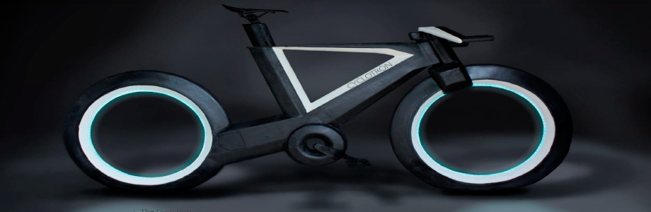

# 

# movilidad-emergencia

[Futuro del transporte 2050 (video)](https://www.youtube.com/watch?v=CUS2w4y2Qj4) - Video de futuros posibles del transporte para el 2050.
# 
>* En este video se muestran realidades futuras del transporte con un claro enfoque en el individuo por sobre la colectividad. Se exploran futuros de Uber. Llama la atención el cuidado por los modelos 3D y sus render, como el desarrollo de cada interfaz de los servicios expuestos. Es importante destacar que se hace más bien referencias al lujo y al comfort indivudual de sociedades desarrolladas, sería importante conocer en un sentido más amplio e inclusivo los alcances de este tipo de avances.
>* En este video se muestran realidades futuras del transporte con un claro enfoque en el individuo por sobre la colectividad. Se exploran futuros de Uber. Llama la atención el cuidado por los modelos 3D y sus render, como el desarrollo de cada interfaz de los servicios expuestos. Es importante destacar que se hace más bien referencias al lujo y al comfort indivudual de sociedades desarrolladas, sería importante conocer en un sentido más amplio e inclusivo los alcances de este tipo de avances.

<!---
Referente Pedro Garretón
-->

[Drone Medico (video)](https://hitconsultant.net/2020/03/10/matternet-secure-medical-drone-delivery-portal-hospitals/#.XoSqLZNKhTZ) - Drone
# 
>* Comentarios del Referente.

<!---
Referente Pedro Garretón
-->

[Cyclotron Bike](https://www.youtube.com/watch?v=XAk6Nt1G5YU) - Cyclotron Bike
# 
>* Bici eléctrica que facilita la movilidad de cortos y largos trayectos. Eco amigable y asequible. Somos seres que necesitan estar en movimiento, cada día tenemos menos tiempo para hacer deporte, por lo que movilizándonos en bicicleta aprovecharemos de realizar actividad física todos los días. A diferencia de los vehículos motorizados, Cyclotron incentiva el deporte y disminuirá los porcentajes de sobrepeso en la población. La aislación y soledad como respuesta a las enfermedades actuales y del futuro provocaran aún más sedentarismo, por lo cual los más deportistas optarán por esta movilización. Cada uno se moverá de manera independiente, lo que ayuda al control de la propagación de virus a través del contacto físico.   
<!---
Referente Victoria Roi
-->

[Multicoaster](https://engineered.thyssenkrupp.com/en/multicoaster-revealed-introducing-the-roller-coaster-of-tomorrow/) - MULTIcoaster
# 
>* Como una montaña rusa alrededor de la ciudad. Son unidades separadas que transportan a una persona o familia pequeña. El usuario es capaz de elegir su ruta una vez que entró a la compuerta, entregando una experiencia única en cada viaje. Para prevenir choques y accidentes, contiene un sistema con inteligencia artificial que coordina el conjunto de viajes. Cada cabina puede avanzar hacia atras y adelante, lo que amplía las posibilidades de trayectos. Viajar en montaña rusa desde tu casa hacia tu trabajo, de manera ecoamigable y mucho más rápida que el metro.

La idea de que sean cabinas separas que transportan solo a personas que viven juntas, ayuda a disminuir el contagio de enfermedades e incentiva el aislamiento. Cada cubículo tiene la tecnología necesaria para investigar el aire de su espacio, por lo que se lleva un control preciso si aparece una persona enferma o con un virus. Así se aisla inmediatamente al ser humano y se evita la propagación de la enfermedad.  
<!---
Referente Victoria Roi
-->

[Caminando sobre el agua](https://www.youtube.com/watch?v=KB-7doKro_0) - Caminando sobre el agua
# 
>* Debido a la obligación de no contacto con los demás, esta movilización será una opción efectiva para llevar al mínimo el traspaso de virus de manera física. Además al considerar el aumento del nivel del mar durante los próximos años, muchas ciudades estarán sumergidas y transportarse de un lugar a otro utilizando estas esferas será mucho más factible y asequible para todos.    
<!---
Referente Victoria Roi
-->

[Zapatillas del futuro](https://www.businessinsider.es/zapatillas-futuro-seran-reciclables-contaran-pasos-474027) - Zapatillas del futuro
# 
>* Zapatillas ecoamigables: 100% reciclables  creadas con un ciclo completamente cerrado. Biofibras de algas que pueden hacer que las zapatillas crezcan, así se reduce la compra constante de nuevas zapatillas debido a cambios de talla.  

En cuanto a los estados de emergencia los pasos serán rastreados gracias a las zapatillas. De esta manera se llevará un mapa de los pasos que cada personas hace, para lograr tener un control total durante las cuarentenas y toques de queda.     
<!---
Referente Victoria Roi
-->

[Postmodern Skateboard](https://www.youtube.com/watch?v=YiK0RD7WGGI) - Postmodern Skateboard
# 
>* Para poder seguir realizando skateboard, pero avanzar más rápido. Dos ruedas no conectadas, al moverse con el cuerpo hacia adelante avanzan, así sin importar la experiencia ni la edad del usuario todos pueden aprender. Al considerar situaciones de emergencia, moverse con el postmodern skateboard ayudará a incentivar la movilización unitaria y la independencia. De esta manera los números de contagiados de todo tipo de enfermedades bajarán.          
<!---
Referente Victoria Roi
-->

[Ascensor espacial](https://www.technologyreview.es/s/11458/el-futuro-viaje-de-la-tierra-la-luna-bordo-de-un-ascensor-espacial) - Ascensor espacial
# 
>* Un ascensor que nos llevará al espacio debido al mal estado en el que dejamos la tierra. Las nuevas enfermedades creadas por el ser humano, debido al consumo de animales, nos obligaron a escapar a otros planetas y volverlos habitables. No fuimos capaces de encontrar curas para los virus, y las medidas de aislamiento no fueron suficientes para combatir y superar las situaciones de emergencia. 

Este ascensor es alimentado por energía solar y se mantiene en funcionamiento por las fuerzas centrífugas. Los primeros viajes serán hacia la luna, el túnel colgará desde allá hacia la tierra. Así orbitaría solo una vez al mes.  
<!---
Referente Victoria Roi
-->

[Megacities](https://engineered.thyssenkrupp.com/en/life-above-the-smog/) - Sobre el smog
# 
>* Debido a las grandes concentraciones de smog en las ciudades más populares, éstas se verán obligadas a trasladarse hacia arriba. Por lo que se construirán  ciudades modulares sobre los espacios actuales. Estos lugares estarán sobre la contaminación y serán sustentables para preservar el aire limpio. No habrá más movilización del ser humano de un lugar hacia otro, gracias al internet no será necesario salir de las casas para realizar compras ni para trabajar. Ésto disminuirá al máximo el contacto físico entre las personas, lo que conlleva al aislamiento constante, asímismo no habrán más contagios de enfermedades. Al descubrir un nuevo virus éste se quedará dentro de la casa del infectado hasta su total extinción.            
<!---
Referente Victoria Roi
-->

## Consideraciones
- Las imagenes deben ser subidas en .png, 96dpi máximo, 920x300 px.
- Cada alumno debe subir al menos 5 referentes con su respectivo comentario.
- El taller debe proponer categorías para organizar el listado de software e implementarlo.

