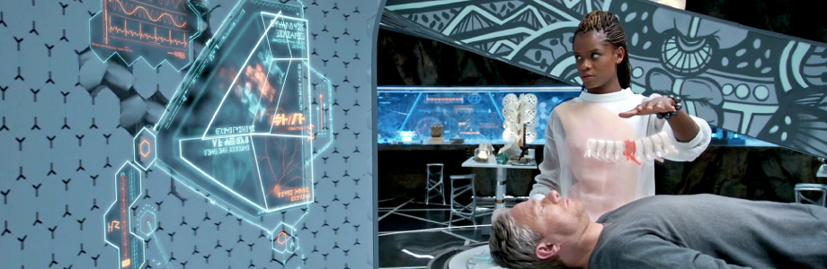

# 

# movilidad-emergencia

[Diagnostico Preciso (video)](https://www.youtube.com/watch?v=EZZUwU9ZRsQ) - Medicina del futuro
# 
>* Tomando como referencia a Black Panter de Marvel, nos encontramos con Wakanda una ciudad altamente tecnologica en la que tanto las armas, como la ciudad y la medicina estan a la vanguardia del mundo.
En el laboratorio de Shuri, Ross es examinado y vemos retroalimentación biométrica de varias formas que se muestran en la pantalla y en forma holográfica, la proyección holográfica del área dañada de la columna vertebral permite dar un diagnostico sin someterse a distintos examenes un tanto lentos e inexactos.  Los accidentes nos expoenen a ser sumamente vulnerables y el factor tiempo es algo que corre en contra cuando se trata de salvar una vida o en el caso de una comunidad, evitar que se de el colapso del sistema de salud debido a que los examenes son lentos y se tiene pocos equipos.
[SwordArtOnline](http://experienceperception.com/black-panther-fui.html) se hace cargo de la exploración de la tecnologia en wakanda

<!---Referente gabrielaarisel-->

## Consideraciones
- Las imagenes deben ser subidas en .png, 96dpi máximo, 920x300 px.
- Cada alumno debe subir al menos 5 referentes con su respectivo comentario.
- El taller debe proponer categorías para organizar el listado de software e implementarlo.

