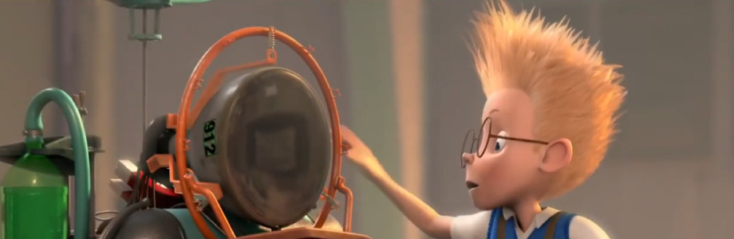
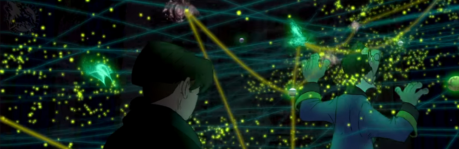

# movilidad-emergencia

[Inside Out (video)](https://www.youtube.com/watch?v=EZZUwU9ZRsQ) - Nuestros recuerdos
# 
>* Nuestra mente y nuestros recuerdos, cómo se clasifican y cómo podemos viasualizar todos esos recuerdos. La gnosis, terapias y sesiones psicológicas apuntan a poder recordar momentos traumáticos y explicar el impacto en nuestro comportamiento. ¿Que tal si podríamos decifrar la manera en que nuestro cerebro ordena todo esto? Después de todo ningún computador ha logrado ser como nuestra mente

<!---Referente gabrielaarisel-->

[Big Hero 6 (video)](https://www.youtube.com/watch?v=EZZUwU9ZRsQ) - Contención médica
# 
>* Robot con atención médica, Baymax está programado con un chip para el servicio médico, atiende con paciencia a los pacientes y le es importante dar un buen servicio. Su diagnóstico es preciso ya que sus ojos son un escaneo directo a tu cuerpo y logra detectar las dolencias de esa manera, te permite evaluar el dolor en base a una tabla. Este robot logra entregar confianza y es sensible respecto a el estafo del paciente.

<!---Referente gabrielaarisel-->

[La Familia del Futuro (video)](https://www.youtube.com/watch?v=EZZUwU9ZRsQ) - Maquina de recuerdos 
# 
>* La familia del futuro, la máquina que permite volver a ver tus recuerdos desde la fecha y hora.
Nuestro cerebro logra almacenar mucha información y aquí el referente da la importancia de nuestros recuerdos y logra proyectarlos en una pantalla, ¿que es aquello que nos hace humanos? ¿Donde queda todo nuestro aprendizaje y recordar nuestras experiencias? Aquí una cámara logra ser el acercamiento a congelar un momento de nuestra vida, pero ¿cómo logramos ver todos los recuerdos de nuestra memoria?

<!---Referente gabrielaarisel-->

[Planeta del tesoro (video)](https://www.youtube.com/watch?v=lFG9YNz9Q20&feature=youtu.be) - Mapa de los mil mundos
# 
>* La esfera que persiguen los piratas galácticos es un mapa que logra insertarse en un planeta y que logra abrir portales a cualquier lugar del espacio, el usuario de esa esfera robaba en la galaxia y ocultaba su tesoro en su propio planeta. El futuro se ve como un lugar en donde los portales si son algo posible y que facilitan perder moverse espontáneamente de un lugar a otro y en este caso con expediciones o vehículos de gran tamaño con grupos de personas numerosas.

<!---Referente gabrielaarisel-->

[Robots (video)](https://www.youtube.com/watch?v=EZZUwU9ZRsQ) - Reinventarse
# 
>*Nuestra necesidades son distintas desde nuestro contexto socioeconómico, por lo que si bien esta se presenta como una necesidad robot, se pone sobre la mesa la importancia de reparar y la importancia de conocerse mejor. El futuro antes se veia como algo frio y distante pero el humano tiene la necesidad de humanizarse aun mas, generar empatia y conexion con su entorno. "No importa de lo que estes hecho, puedes brillar"

<!---Referente gabrielaarisel-->